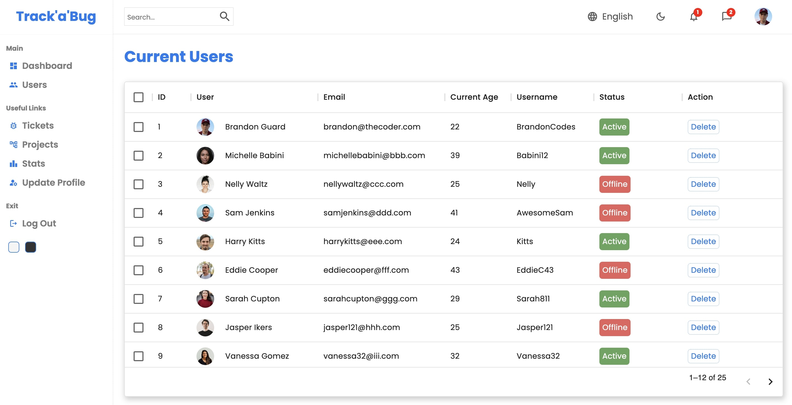

# Bug Tracker

> A Project Management application that is intended for use as an internal tool to help organisations track software bugs.

---

### Table of Contents

- [Overview](#overview)
- [Technologies](#technologies)
- [Features](#features)
- [Log In Page](#log-in-page)
- [Dashboard](#dashboard)
- [Page Navigation](#page-navigation)
- [Users](#users)
- [Update Profile](#update-profile)
- [Forgot Password](#forgot-password)
- [Projects](#projects)
- [Stats](#stats)
- [Toggle Dark Mode](#toggle-dark-mode)
- [Report Bugs](#report-bugs)
- [License](#license)
- [Author Info](#author-info)

---

## Overview

Track'a'Bug is a Project Management application that is intended for use as an internal tool within an organisation, to track software bugs throughout the entire process of development, testing and production.

I built this app with a React frontend and utilised Google Firebase to implement user functionality features, such as the ability for users to Sign Up, Log In, Log Out and Reset Passwords.

[Back To The Top](#bug-tracker)

---

## Technologies

- HTML5
- CSS3
- JavaScript
- React
- MaterialUI
- SASS (SCSS)
- Bootstrap
- Google Firebase
- API (Recharts API)

[Back To The Top](#bug-tracker)

---

## Features

- Sign Up
- Log In
- Password Confirmation
- Reset Password
- Dashboard
- Users
- Delete Users
- View Tickets
- View Projects
- Bug Statistics
- Update Profile
- Log Out

[Back To The Top](#bug-tracker)

---

## Log In Page

When you're at the landing page you can go ahead and Sign Up or Log In (if you already have an existing account).

You can Log In for the first time using:

- Email: admin@admin.com
- Password: password

[Back To The Top](#bug-tracker)

---

## Dashboard

After Signing Up / Logging In, you'll be directed to the Dashboard page which showcases the number of users using the software, total number of tickets, total number of projects, percentage of bugs that were urgent in the last 30 days, bugs resolved over the last 6 months and current bug tickets.

[Back To The Top](#bug-tracker)

---

## Page Navigation

From the Dashboard, you can easily navigate to other pages within the application (Users, Tickets, Projects, Stats, Update Profile, Log Out) by using the Main Menu which is displayed on the left hand side of all pages within the app.

[Back To The Top](#bug-tracker)

---

## Users

This page displays the Current Users using the application, and their user information such as User ID, Full Name, Email, Current Age, Username and Status in table format.

In addition to this, each User has their own Actions section within the table, where you can click the 'View' button and view all info that is specific to that User (such as their phone number, timezone and the bugs they have solved in the last 30 days) or click the 'Delete' button to remove the User from the Users table.

You can also filter Users by their User IDs, names, emails and usernames in Alphabetical order, their Age (Oldest - Youngest or Youngest - Oldest) and their Status (Active or Offline).

[Back To The Top](#bug-tracker)

---

## Update Profile

The Update Profile page allows employees at the organisation to update their Email and Password credentials for the application.

[Back To The Top](#bug-tracker)

---

## Forgot Password

If an employee happens to forget their password they can easily navigate to the Forgot Password page from the app's landing page.

Once they are there, the employee can enter their account email and click the 'Reset Password' button.

If they entered their email correctly, a message will be displayed above the Email field informing the user to check their email for further instructions.

From there, they can click the link sent to their email address and reset their password. Simple!

[Back To The Top](#bug-tracker)

---

## Projects

The Projects page allows the logged in user to view all the Projects that their organisation is currently working on.

Alongside this, the page provides a brief description of each Project, the Project Duration, Priority Level and the Assigned Team that are responsible for completing that project.

[Back To The Top](#bug-tracker)

---

## Stats

The Stats page includes a bar chart displaying Developer Performance Ratings where Q1 & Q2 of this year is compared to Q1 & Q2 of the previous year.

There's also stats for Urgent / Non-Urgent Bugs in the Last 30 Days and for Bugs Resolved in the Last 6 months.

[Back To The Top](#bug-tracker)

---

## Toggle Dark Mode

Within Bug Tracker, you can easily switch the app to the style that most suits you with the Light / Dark Mode feature.

It's super easy to switch between modes, just click the Light or Dark Mode colour swatch located at the bottom of the Sidebar Menu.

You can also click the half moon icon in the Navbar, when you click the icon the mode will automatically switch.

[Back To The Top](#bug-tracker)

---

## Report Bugs

Found a bug? Please report it to me, brandonlguard@gmail.com. Thank you!

---

## License

MIT License

Copyright (c) [2022] [Brandon Guard]

Permission is hereby granted, free of charge, to any person obtaining a copy
of this software and associated documentation files (the "Software"), to deal
in the Software without restriction, including without limitation the rights
to use, copy, modify, merge, publish, distribute, sublicense, and/or sell
copies of the Software, and to permit persons to whom the Software is
furnished to do so, subject to the following conditions:

The above copyright notice and this permission notice shall be included in all
copies or substantial portions of the Software.

THE SOFTWARE IS PROVIDED "AS IS", WITHOUT WARRANTY OF ANY KIND, EXPRESS OR
IMPLIED, INCLUDING BUT NOT LIMITED TO THE WARRANTIES OF MERCHANTABILITY,
FITNESS FOR A PARTICULAR PURPOSE AND NONINFRINGEMENT. IN NO EVENT SHALL THE
AUTHORS OR COPYRIGHT HOLDERS BE LIABLE FOR ANY CLAIM, DAMAGES OR OTHER
LIABILITY, WHETHER IN AN ACTION OF CONTRACT, TORT OR OTHERWISE, ARISING FROM,
OUT OF OR IN CONNECTION WITH THE SOFTWARE OR THE USE OR OTHER DEALINGS IN THE
SOFTWARE.

[Back To The Top](#bug-tracker)

---

## Author Info

- Twitter - [@BrandonGuard99](https://twitter.com/BrandonGuard99)
- Website - [Brandon Guard](https://www.brandonguard.com)

[Back To The Top](#bug-tracker)
